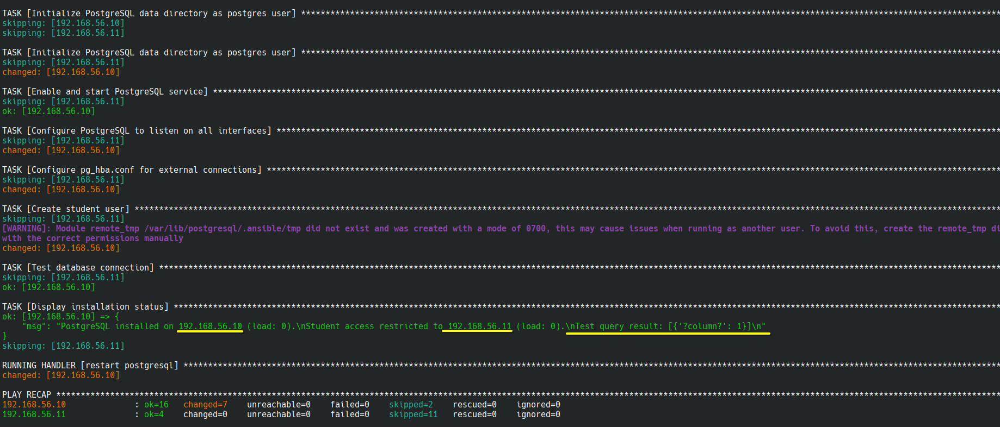

# pg_devops_intern_task
## Solution for Postgres Pro's task for interns
* Решение этого задания в папке src ветки develop. Было принято решение использовать bash + ansible.
* Пароль от ansible vault - `PostgresProForeverAndEver!#()@hehe`. С помощью него зашифрован пароль юзера student в postgres.
* Для удобства тестирования создан Vagrantfile с двумя виртуальными машинами - debian, almalinux. Для обхода блокировок российских ip при загрузке боксов используется tor + proxychians (после загрузки боксов нужно прервать proxychians, иначе vagrant не сможет соединиться с машинами):

* выполнение программы и запуск playbook:

* в конце выполнения playbook отображается вывод запроса SELECT 1 вместе с остальной информацией:

* по условию задачи, postgres на target server принимает соединения. Подключаемся к юзеру postgres. К юзеру student подключиться с хоста не можем, как и задумано:

* подключаеся к student со второй виртуальной машины:

* Вопросы в ходе выполнения - мне было не совсем понятно, что такое server load в вашей интерпретации. Решил использовать то, что чаще всего попадается в гугле - вывод команды uptime с awk. Больше вопросов не было, вроде все понятно, задание хорошо сформулировано.
